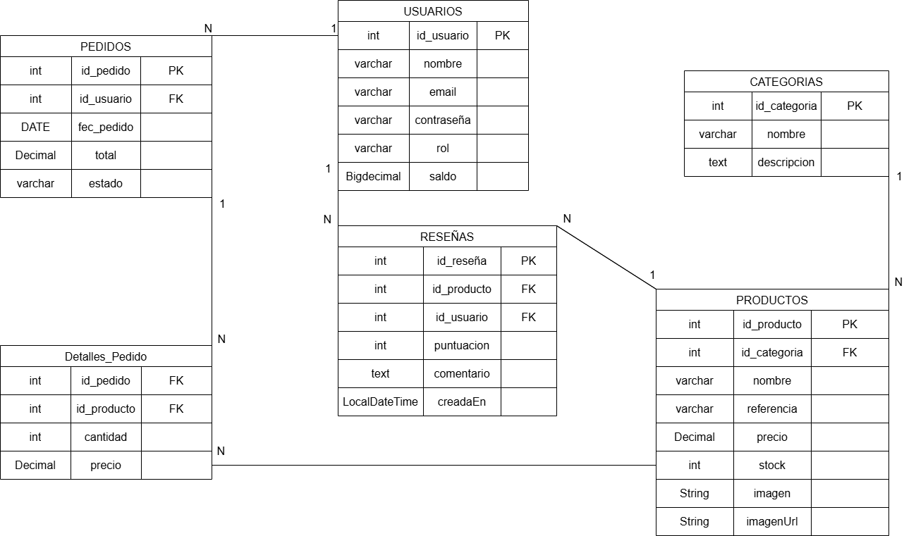

# Motores&Bits
---

## Índice

- [LOGO](#logo)
- [Integrantes](#integrantes)
- [Eslogan](#eslogan)
- [Resumen](#resumen)
- [Descripción](#descripción)
- [Casos de Uso](#casos-de-usos)
- [Funcionalidades implementadas](#funcionalidades-implementadas)
- [Funcionalidades opcionales, recomendables o futuribles](#funcionalidades-opcionales-recomendables-o-futuribles)
- [Diagrama E/R](#diagramaer)
- [Explicación diagrama E/R](#explicacion-diagramaer)
- [Modelo de datos](#modelo-de-datos)
- [Reglas y validaciones](#reglas-y-validaciones)
- [Flujo de Checkout](#flujo-de-checkout)
- [Facturación PDF](#facturación-pdf)
- [Monedero / Saldo](#monedero--saldo)
- [Docker con MariaDB](#explicacion-de-docker-con-mariadb)
- [Tecnología / Tests](#tecnología--tests)
- [Explicación de tests](#explicacion-test)
    - [Tests de service](#tests-de-service)
    - [Tests generales / use cases](#tests-generales--use-cases)
    - [Tests de repositorio](#tests-de-repositorio)
    - [Tests de borrado e integridad](#tests-de-borrado-e-integridad)
    - [Infraestructura de tests](#infraestructura-de-tests)
- [Datos iniciales (seed)](#datos-iniciales-seed)
- [Buenas prácticas y decisiones de diseño](#buenas-prácticas-y-decisiones-de-diseño)
- [Cómo ejecutar](#cómo-ejecutar)

---

# LOGO


---

# Integrantes

-   Javier Prada Naharros 07272502V


-   Hugo Rodríguez Galván 45971797H


---

# Eslogan

"Motores que giran, bits que conectan"

---

# Resumen

La aplicación web nos permitirá gestionar un taller de forma digital, el
administrador se encargará de añadir, modificar o eliminar objetos
(piezas de coches, recambios u otros elementos disponibles). Los
clientes podrán navegar por la aplicación, consultar los productos y
realizar compras de manera sencilla.

Además, el sistema incorpora funcionalidades de **monedero/saldo**, la posibilidad de
**pagar pedidos con saldo** (validando saldo suficiente), la **cancelación de pedidos con
reposición de stock** (cuando el flujo lo permite) y la **generación de facturas en PDF**.

---

# Descripción

La aplicación está diseñada para optimizar la interacción entre un
taller y sus clientes.

El sistema cuenta con dos roles principales:

-   Administrador: encargado de gestionar el inventario, actualizar
    productos y mantener la información al día.

-   Cliente: usuario que podrá explorar los objetos disponibles, filtrar
    por categorías y efectuar compras si lo desea.

---

# Casos de Usos

### Cliente
1. **Registrarse / Iniciar sesión**
2. **Explorar catálogo por categoría**
3. **Ver detalle de producto** (incluye reseñas)
4. **Añadir al carro**
5. **Checkout**
    - Crea `PEDIDOS` (id_usuario, fec_pedido, total, estado="PENDIENTE").
    - Crea `DETALLES_PEDIDO` (id_pedido, id_producto, cantidad, precio del momento).
    - **Actualiza `PRODUCTOS.stock`**.
    - **Valida y descuenta `USUARIOS.saldo`** si el pago se realiza con saldo.
6. **Ver mis pedidos**
7. **Crear reseña** (puntuación 1–5)
8. **Cancelar pedido** (si el estado lo permite)
    - Reposición de stock en `PRODUCTOS.stock`.
    - Reembolso de saldo en `USUARIOS.saldo` si el pedido estaba pagado con saldo.
9. **Descargar factura PDF** asociada al pedido

### Administrador
8. **CRUD de categorías**
9. **CRUD de productos** (referencia única; stock ≥ 0)
10. **Consultar pedidos y su detalle**
11. **Actualizar estado del pedido** (PENDIENTE→PAGADO→ENVIADO→ENTREGADO; CANCELADO con reposición de stock si procede)
12. **Moderación de reseñas**
13. **Gestión de saldo**
    - El administrador puede ajustar el saldo de usuarios (por recargas, incidencias, devoluciones, etc.).

---

## Funcionalidades implementadas

### Monedero / Saldo
- Cada usuario dispone de un campo `saldo` asociado.
- **Gestión de saldo**:
    - El usuario puede consultar y recargar su saldo.
    - El administrador puede modificar el saldo de cualquier usuario.
- **Pago con saldo**:
    - Antes de confirmar un pedido se valida que el saldo sea suficiente.
    - Si el pago se confirma, se descuenta el saldo correspondiente.
- **Devolución de saldo**:
    - En cancelaciones permitidas, el sistema puede reembolsar el saldo (según el estado y política definida).

### Pedidos: cancelación con reposición de stock
- Cancelación controlada según estado (p. ej. no se permite cancelar si ya ha sido enviado/entregado).
- Si se cancela:
    - Se reponen las unidades en stock de cada producto.
    - Se ajusta el total y el estado del pedido.
    - Si el pedido estaba pagado con saldo, se devuelve el importe al monedero.

### Facturación (PDF)
- Generación de factura PDF a modo de comprobante del pedido.
- La factura incluye:
    - Datos de usuario (nombre/email y, si aplica, dirección/teléfono).
    - Datos del pedido (id, fecha, estado, total).
    - Líneas del pedido (producto, cantidad, precio histórico, subtotal).
- El PDF se obtiene desde la zona de pedidos (cliente) y/o desde administración (si lo tenéis).

### Reseñas
- Los clientes pueden crear reseñas con puntuación (1 a 5).
- Se listan reseñas por producto y se puede calcular la media.
- Moderación por admin (editar/eliminar).

---

## Funcionalidades opcionales, recomendables o futuribles

-   Recomendación de productos relacionados en base a la búsqueda o
    compras anteriores.

-   Posibilidad de que los clientes dejen reseñas y valoraciones de los
    productos. *(Implementado en la versión actual)*

-   Multilenguaje para la interfaz de la aplicación.

-   Posibilidad de que el cliente puede modificar su perfil. *(En la versión actual existe edición de datos básicos; se puede ampliar)*

-   Notificaciones por email (confirmación de pedido, cambios de estado).
-   Panel de analítica (ventas por período, productos más vendidos).
-   Integración con pasarela externa (Stripe/PayPal) además del monedero.

---

# DiagramaE/R



## Explicacion diagramaE/R

El diagrama representa un sistema de ventas para un taller, donde los usuarios realizan pedidos compuestos por varios productos.
Los productos se organizan en categorías y pueden recibir reseñas de los usuarios, con puntuación y comentario.
La relación entre pedidos y productos se resuelve con Detalles_Pedido, que guarda cantidad y el precio histórico de cada línea.

### Tablas

- USUARIOS (id_usuario PK)
  Campos: nombre, email, contrasena, rol.

- CATEGORIAS (id_categoria PK)
  Campos: nombre, descripcion.

- PRODUCTOS (id_producto PK, FK id_categoria)
  Campos: nombre, referencia, precio, stock.

- PEDIDOS (id_pedido PK, FK id_usuario)
  Campos: fec_pedido, total, estado.

- Detalles_Pedido (FK id_pedido, FK id_producto)
  Campos: cantidad, precio.

- RESEÑAS (id_reseña PK, FK id_producto, FK id_usuario)
  Campos: puntuacion, comentario.

### Relaciones (cardinalidades)

- Usuarios 1—N Pedidos: un usuario puede tener muchos pedidos; cada pedido pertenece a un usuario.
- Usuarios 1—N Reseñas: un usuario puede escribir muchas reseñas.
- Productos 1—N Reseñas: un producto puede recibir muchas reseñas.
- Categorías 1—N Productos: una categoría agrupa varios productos.
- Pedidos N—N Productos a través de Detalles_Pedido: un pedido tiene varios productos y un producto puede aparecer en muchos pedidos.

---

# Modelo de datos

## USUARIOS
- `id_usuario` (PK)
- `nombre`
- `email` (único)
- `contrasena`
- `rol` (ADMIN/CLIENTE)
- `direccion`
- `telefono`
- `saldo`

## CATEGORIAS
- `id_categoria` (PK)
- `nombre`
- `descripcion`

## PRODUCTOS
- `id_producto` (PK)
- `id_categoria` (FK)
- `nombre`
- `referencia` (única)
- `precio`
- `stock`
- `version` (para control de concurrencia / optimistic locking)
- `imagen` (nombre de archivo, opcional)
- `imagen_url` (url completa, opcional)

## PEDIDOS
- `id_pedido` (PK)
- `id_usuario` (FK)
- `fec_pedido`
- `estado` (CREADO, PENDIENTE, PAGADO, ENVIADO, ENTREGADO, CANCELADO)
- `total`

## DETALLES_PEDIDO
- PK compuesta (`id_pedido`, `id_producto`)
- `cantidad`
- `precio` (precio histórico en el momento de compra)

## RESEÑAS
- `id_resena` (PK)
- `id_producto` (FK)
- `id_usuario` (FK)
- `puntuacion` (1..5)
- `comentario`
- `creada_en` (timestamp)

---

## Explicacion de docker con MariaDB

Aqui se va a explicar como crear un docker con la imagen de MariaDB

1. Tener descargado la aplicacion de docker en el dispositivo y funcionando.
2. Descargar la imagen de MariaDB (si no la tienes)
```bash
  docker pull mariadb:latest
```
3. Crear el contenedor con el nombre motores_bits
```bash
   docker run -d --name motores_bits -e MYSQL_ROOT_PASSWORD=proyectomdai -e MYSQL_DATABASE=MotoresBits -p 3306:3306 mariadb:latest
```
4. Verificar que el contenedor está corriendo
```bash
  docker ps
```
## Reglas y validaciones
- `Usuario.email` **único**.
- `Producto.referencia` **única**; `stock ≥ 0`.
- `DetallePedido.cantidad ≥ 1`.
- `Resena.puntuacion` ∈ [1..5].
- Estados de pedido con transiciones válidas.
- Integridad referencial: no se permite borrar entidades con dependencias (según FK y reglas de negocio).

---

## Flujo de Checkout
1. Cliente confirma carro → **calcular total**.
2. Validar stock disponible por producto.
3. Validar saldo si el pago se realiza con monedero.
4. Crear `PEDIDO` (estado = `PENDIENTE`).
5. Por cada ítem: crear `DETALLE_PEDIDO` con **precio snapshot** y **cantidad**, y **descontar stock**.
6. Descontar saldo del usuario (si aplica).
7. Generar factura en PDF (si aplica en el flujo).
8. Devolver nº de pedido.
9. Admin puede **actualizar estado** posteriormente.

---

## Facturación PDF

- La factura se genera a partir de:
    - Cabecera: datos del pedido y del usuario
    - Detalle: líneas del pedido con precio histórico
    - Totales: subtotal/total final
- La factura es un documento que facilita:
    - Confirmación de compra
    - Auditoría o revisión de pedidos
    - Uso académico/demostración de generación de documentos

---

## Monedero / Saldo

- El saldo se almacena en `USUARIOS.saldo`.
- Casos típicos:
    - Recarga manual por el usuario.
    - Ajuste por el admin (soporte, incidencias).
    - Pago de pedidos con validación estricta.
    - Reembolso en cancelación (si procede).

---

## Tecnología / Tests
- Spring Boot, JPA/Hibernate.
- BBDD de desarrollo/tests: **H2**; producción: MariaDB.
- Tests de integración con perfil `test` y **fábrica de datos** (H2 en memoria).
- JUnit 5.
- Maven/Gradle (según configuración del proyecto).

---

# Explicacion Test

Explicacion de los test que aparecen en el paquete `src/test/java/es/unex/cum/mdai/motoresbits`.
Por cada test se indica: intención, pasos de setup y las aserciones principales.

---

## Tests de service

### `UsuarioServiceIT`
- Objetivo: validar la lógica de negocio de usuarios y autenticación.
- Casos cubiertos:
    - Registro de cliente con normalización de email (trim + lowercase).
    - Error si el email ya existe (unicidad).
    - Lectura por ID y error si no existe.
    - Login correcto y fallos por credenciales incorrectas.
    - Eliminación de usuario:
        - OK si no tiene pedidos.
        - Falla si tiene pedidos asociados.
    - Prueba de concurrencia:
        - varios hilos intentando registrar el mismo email → solo 1 éxito.

### `CatalogoServiceIT`
- Objetivo: validar CRUD de categorías y productos desde service.
- Casos cubiertos:
    - Crear/obtener/listar/editar/eliminar categorías.
    - No permitir eliminar categoría con productos.
    - Crear/obtener/listar productos.
    - Listar por categoría.
    - Unicidad de referencia de producto.
    - No permitir eliminar producto con:
        - reseñas asociadas
        - líneas de pedido asociadas (detalles_pedido)

### `PedidoServiceIT`
- Objetivo: validar flujo de pedido y manipulación de líneas.
- Casos cubiertos:
    - Crear pedido para usuario existente (estado inicial y total 0).
    - Error si usuario no existe.
    - Obtener pedido con líneas y productos.
    - Añadir línea:
        - crea nueva línea y recalcula total
        - si ya existe, suma cantidades y recalcula total
        - valida cantidad > 0
    - Cambiar cantidad:
        - recalcula total
        - cantidad 0 elimina línea
    - Eliminar línea:
        - borra la línea y deja total coherente
        - error si la línea no existe
    - Cambiar estado:
        - transiciones válidas
        - rechazo de transiciones inválidas
        - bloqueo desde estados finales

### `ResenaServiceIT`
- Objetivo: validar creación/edición y agregados (media).
- Casos cubiertos:
    - Crear reseña válida y listar por producto.
    - Validación de puntuación (1..5).
    - Media de puntuación por producto.
    - Editar reseña (puntuación y comentario).

---

## Tests generales / use cases

### `ApplicationTests`
- Intención: comprobar que el contexto de Spring arranca con el perfil `test`.
- Aserción: el test pasa si el contexto carga sin errores (wiring correcto).

### `AdminUseCasesTest`

- `categoria_crud_basico`
    - Intención: validar las operaciones CRUD básicas sobre `Categoria`.
    - Setup: crear una `Categoria`, guardarla, actualizar su nombre y eliminarla.
    - Aserciones: la lista inicial contiene la categoría creada; tras la actualización el nombre persiste; tras el borrado la búsqueda por id devuelve empty.

- `producto_crud_y_listado_por_categoria`
    - Intención: CRUD sobre `Producto` y listado por categoría.
    - Setup: crear categoría (factory), crear producto manualmente, modificar precio y stock, persistir y recuperar por id y por categoría.
    - Aserciones: precio actualizado, stock actualizado, que el listado por categoría contiene la referencia esperada; tras borrar, la entidad deja de existir.

- `pedido_maestro_detalle_con_lineas_y_productos`
    - Intención: comprobar que un `Pedido` puede tener detalles (líneas) y que el repositorio puede recuperar el pedido con sus líneas y productos (JOIN FETCH).
    - Setup: crear usuario y productos, crear pedido, añadir líneas y persistir.
    - Aserciones: al recuperar con `findConLineasYProductos` el pedido tiene tantos detalles como se añadieron y cada detalle tiene producto y precio no nulos.

- `pedido_actualizar_estado`
    - Intención: verificar transiciones de estado de `Pedido` y que se persisten.
    - Setup: crear pedido inicial con estado PENDIENTE; actualizar sucesivamente a PAGADO, ENVIADO y ENTREGADO.
    - Aserciones: tras cada saveAndFlush, la entidad recuperada refleja el nuevo estado.

- `moderar_resenas_editar_y_eliminar`
    - Intención: demostrar la moderación de reseñas: edición y eliminación.
    - Setup: crear usuario, categoría y producto, crear reseña, actualizar sus campos y eliminarla.
    - Aserciones: tras la edición, la reseña recuperada muestra los nuevos valores; tras el delete la búsqueda por id es empty.

### `GeneralSmokeTests`

- `usuario_registroLogin_y_unicidadEmail`
    - Intención: flujo básico de registro + comprobación de unicidad del email.
    - Setup: crear usuario, persistir, cargar por email; intentar crear otro con mismo email para forzar DataIntegrityViolationException.
    - Aserciones: id asignado tras persistir, contraseña almacenada correctamente (en este proyecto sin encoder) y la excepción al duplicar email.

- `productos_porCategoria_y_unicidadReferencia`
    - Intención: listado de productos por categoría y validación de unicidad de `referencia`.
    - Setup: crear categoría, dos productos (uno manual, otro por factory), verificar listado; luego intentar crear producto con referencia duplicada y esperar DataIntegrityViolationException.
    - Aserciones: el listado contiene las referencias esperadas; la inserción duplicada lanza la excepción.

- `resenas_crear_listar_validarYMedia`
    - Intención: cubrir creación de reseñas, validación del rango de puntuación y cálculo de la media.
    - Setup: crear usuarios, categoría y producto; crear reseña válida, intentar reseña inválida (puntuación fuera de 1..5) y comprobar que lanza ConstraintViolationException; crear otra reseña válida y comprobar lista y media.
    - Aserciones: la excepción se lanza para puntuaciones inválidas; la lista de reseñas del producto tiene el tamaño esperado; la media es la esperada (se comprueba con offset numérico).

- `pedidos_checkout_joinFetch_y_orphanRemoval`
    - Intención: flujo de checkout que crea pedido y líneas, comprobación join-fetch y orphanRemoval tras eliminar una línea.
    - Setup: crear usuario, categoría, productos; crear pedido, añadir líneas, persistir; comprobar detalle por pedido/producto; recuperar pedido con líneas; remover una línea y verificar que ya no existe el detalle.
    - Aserciones: detalle presente antes de remover; después de remover, consulta por ese detalle devuelve empty.

### `UsuarioUseCasesTest`
- Objetivo: validar casos básicos del “usuario” (registro/login) con repositorios y reglas de unicidad.
- Casos:
    - registro correcto y lectura por email
    - registro duplicado (falla)
    - login correcto (comparación simple)
    - login con email inexistente
    - login con contraseña incorrecta

---

## Tests de repositorio

### `PedidosRepositoryTest`

- `crearPedidoConLinea_y_consultarPorUsuarioYProducto`
    - Intención: crear pedido con línea y verificar consultas por usuario y por producto.
    - Setup: usar factory para crear usuario/categoría/producto, crear pedido con línea, persistir.
    - Aserciones: pedido recuperable por usuario, detalle encontrado por pedidoId y productoId con cantidad y precio esperados.

- `joinFetch_pedidoConLineasYProductos`
    - Intención: comprobar método que recupera pedido con líneas y productos mediante JOIN FETCH.
    - Setup: crear pedido y añadir varias líneas con productos, persistir.
    - Aserciones: al cargar con el método, detalles de tamaño esperado y que cada detalle contiene producto y precio no nulos.

- `orphanRemoval_quitarLineaBorraEnBD`
    - Intención: verificar orphanRemoval en la colección de líneas del pedido.
    - Setup: crear pedido y una línea, persistir, contar líneas, remover línea, persistir.
    - Aserciones: antes count == 1; después count == 0.

- `transaccion_rollback_alFallar_dentroDeTransaccionNueva`
    - Intención: asegurar que una transacción nueva que falla realiza rollback sin afectar la transacción externa.
    - Setup: crear recurso y ejecutar código dentro de TransactionTemplate con PROPAGATION_REQUIRES_NEW que lanza RuntimeException.
    - Aserciones: tras el fallo, las operaciones realizadas en la transacción nueva no deben persistir (consulta por usuario devuelve vacío).

### `ProductosCategoriasRepositoryTest`

- `categoria_crear_y_listarProductosPorCategoria`
    - Intención: crear categoría y listar productos por categoría.
    - Setup: factory crea categoría y dos productos; persistir.
    - Aserciones: la consulta por categoría devuelve ambos productos; comprobación por referencias con containsExactlyInAnyOrder.

- `producto_unicidadReferencia_debeLanzarExcepcion`
    - Intención: asegurar que la BD impone unicidad sobre `referencia`.
    - Setup: crear producto con referencia, intentar guardar otro con misma referencia.
    - Aserciones: saveAndFlush del segundo producto lanza DataIntegrityViolationException.

### `ResenasRepositoryTest`

- `crearResena_y_buscarPorProducto`
    - Intención: verificar la creación de una reseña y su recuperación por producto.
    - Setup: factory crea usuario, categoría y producto; se crea reseña con puntuación válida y comentario; se intenta setear fecha si la entidad lo permite.
    - Aserciones: findByProductoId devuelve lista con tamaño 1 y que el usuario asociado coincide por email.

- `validacion_puntuacion_1a5_debeFallarSiSeExcede`
    - Intención: comprobar que puntuaciones fuera de rango alto lanzan ConstraintViolationException.
    - Setup: crear reseña con puntuación 6 y persistir.
    - Aserciones: saveAndFlush lanza ConstraintViolationException.

- `validacion_puntuacion_minima_debeFallarSiEsInferior`
    - Intención: comprobar que puntuaciones por debajo de 1 fallan.
    - Setup: crear reseña con puntuación 0 y persistir.
    - Aserciones: saveAndFlush lanza ConstraintViolationException.

- `mediaDePuntuaciones_porProducto`
    - Intención: comprobar cálculo de la media de puntuaciones por producto.
    - Setup: crear tres usuarios y tres reseñas con puntuaciones 5,4,3; persistir y flush.
    - Aserciones: llamada a avgPuntuacionByProductoId devuelve 4.0 con un offset numérico tolerante.

### `UsuariosRepositoryTest`

- `unicidadEmail_debeLanzarExcepcion`
    - Intención: asegurar la unicidad de `email` en la tabla de usuarios.
    - Setup: usar factory para crear usuario persistido; crear nuevo usuario con el mismo email.
    - Aserciones: saveAndFlush del segundo usuario lanza DataIntegrityViolationException.

---

## Tests de borrado e integridad

### `DeleteBehaviorTests`

- `borrarCategoria_sinProductos_OK`
    - Intención: borrar categoría vacía debe eliminarse sin problemas.
    - Setup: factory crea categoría.
    - Aserciones: tras delete+flush, findById devuelve empty.

- `borrarCategoria_conProductos_FALLA`
    - Intención: intentar borrar categoría con productos relacionados debe provocar una excepción por integridad referencial.
    - Setup: crear categoría y un producto asociado.
    - Aserciones: delete+flush lanza DataIntegrityViolationException.

- `borrarProducto_sinDependencias_OK`
    - Intención: borrar producto sin dependencias debe eliminarlo.
    - Setup: crear categoría y producto; eliminar producto.
    - Aserciones: findById devuelve empty.

- `borrarProducto_conResenas_FALLA`
    - Intención: borrar producto con reseñas debe fallar por integridad.
    - Setup: crear producto y reseña asociada.
    - Aserciones: delete+flush lanza DataIntegrityViolationException.

- `borrarProducto_conDetallePedido_FALLA` y `diagnostico_borrarProducto_conDetallePedido`
    - Intención: comprobar comportamiento al borrar producto que aparece en líneas de pedido; en función de la BD se espera excepción o que el producto (o detalle) siga presente.
    - Setup: crear pedido con línea referenciando el producto.
    - Aserciones: si la operación no lanza excepción, se evalúa que al menos exista el producto o el detalle (se asegura que no ambos desaparezcan inesperadamente); si lanza DataIntegrityViolation, se captura y se limpia el contexto.

- `borrarUsuario_sinDependencias_OK`
    - Intención: borrar usuario sin dependencias exitosamente.
    - Setup: crear usuario y eliminarlo.
    - Aserciones: findById devuelve empty.

- `borrarUsuario_conPedidos_FALLA`
    - Intención: borrar usuario con pedidos debe fallar por integridad referencial.
    - Setup: crear usuario, pedido y detalle; intentar borrar usuario.
    - Aserciones: delete+flush lanza DataIntegrityViolationException.

- `borrarUsuario_conResenas_FALLA`
    - Intención: borrar usuario con reseñas debe fallar por integridad referencial.
    - Setup: crear usuario y reseña asociada.
    - Aserciones: delete+flush lanza DataIntegrityViolationException.

- `borrarPedido_borraSusLineas_porCascadeYOrphanRemoval_OK`
    - Intención: borrar pedido debe eliminar sus líneas asociadas cuando cascade+orphanRemoval están configurados.
    - Setup: crear pedido con dos líneas, persistir y confirmar contador de detalles == 2; borrar pedido.
    - Aserciones: tras delete+flush, pedido no existe y detalleRepo.count() == 0.

---

## Infraestructura de tests

### `BaseJpaTest`
- Clase base (abstracta) para centralizar configuración de tests JPA:
    - `@SpringBootTest` para levantar el contexto.
    - `@ActiveProfiles("test")` para usar H2 en memoria.
    - `@Transactional` para rollback automático tras cada test.
- Objetivo: evitar repetir anotaciones y asegurar consistencia en ejecución.

### `TestDataFactory`
- Componente utilitario para generar entidades persistidas de forma rápida y consistente.
- Beneficios:
    - Reduce boilerplate en tests.
    - Genera datos únicos (emails/referencias) para no violar constraints.
    - Permite montar escenarios complejos (pedido con líneas, producto con categoría, etc.).
- Incluye helpers típicos:
    - crear usuario persistido
    - crear categoría persistida
    - crear producto persistido asociado a categoría
    - crear pedido persistido asociado a usuario
    - añadir línea de pedido con cantidad y precio histórico

---

# Datos iniciales (seed)

- Es habitual incluir datos de ejemplo para:
    - usuario admin y usuario cliente
    - categorías iniciales
    - productos de muestra
    - pedido de prueba y reseñas
- Esto facilita la demo y el arranque del proyecto sin “base de datos vacía”.

---

# Buenas prácticas y decisiones de diseño

- **Precio histórico en líneas**: el detalle de pedido guarda el precio del momento para mantener coherencia con facturación.
- **Optimistic locking** (`version` en producto): reduce problemas de concurrencia (p. ej. compras simultáneas).
- **Constraints en BD**: email único, referencia única, check de puntuación, etc.
- **Tests de integración**: se valida el flujo real con persistencia, no solo mocks.
- **Separación por capas**: repositorio (datos), service (negocio), y capa superior (controladores/UI) si aplica.

---

# Cómo ejecutar

## Requisitos
- Java (según versión del proyecto)
- Maven/Gradle
- Docker (para MariaDB) o BD local
